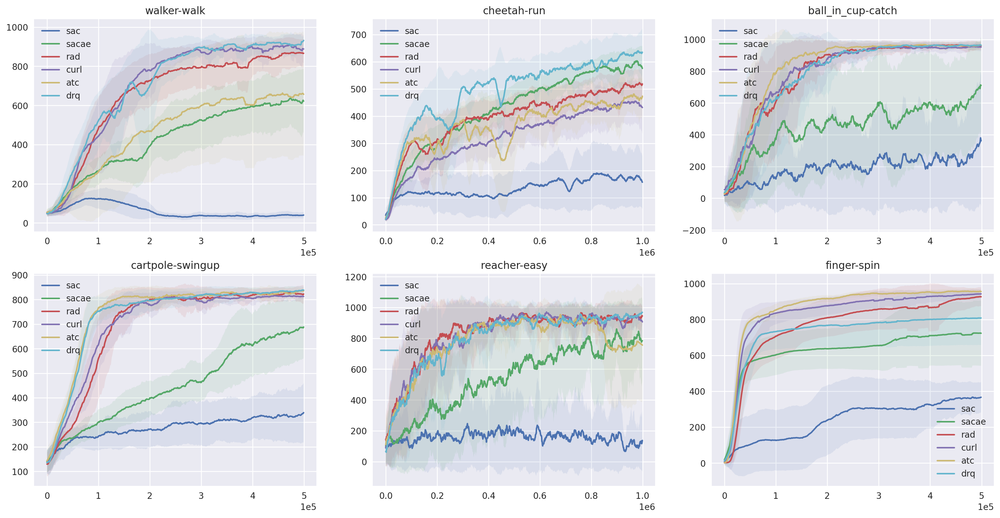

# RL Algorithms for Visual Continuous Control
Pytorch implementations of   
* SAC: [Soft Actor-Critic: Off-Policy Maximum Entropy Deep Reinforcement Learning with a Stochastic Actor](https://arxiv.org/abs/1801.01290)
* SAC+AE: [Improving Sample Efficiency in Model-Free Reinforcement Learning from Images](https://arxiv.org/abs/1910.01741)
* CURL: [CURL: Contrastive Unsupervised Representations for Reinforcement Learning](https://arxiv.org/abs/2004.04136)  
* RAD: [Reinforcement Learning with Augmented Data](https://arxiv.org/abs/2004.14990)
* DrQ: [Image Augmentation Is All You Need: Regularizing Deep Reinforcement Learning from Pixels](https://arxiv.org/abs/2004.13649)
* ATC: [Decoupling Representation Learning from Reinforcement Learning](https://arxiv.org/abs/2009.08319)


## Instructions
Install MuJoCo 2.1 if it is not already the case (please refer to [https://github.com/deepmind/dm_control](https://github.com/deepmind/dm_control). 

Create conda environment
```
conda create -n visualrl -f conda_env.yml
```

Run the code
```
conda activate visualrl
python src/train.py  --agent drq  --domain_name cheetah  --task_name run
```

## Results
Here's the benchmark results on PlaNet Benchmark tasks. All results are averaged over 5 different seeds. 

 


## Citation
Please use the bibtex below if you want to cite this repository in your publications:
````
@misc{rlcodebase,
  author = {Jinwei Xing},
  title = {Pytorch Implementations of Reinforcement Learning Algorithms for Visual Continuous Control},
  year = {2022},
  publisher = {GitHub},
  journal = {GitHub repository},
  howpublished = {\url{https://github.com/KarlXing/RL-Visual-Continuous-Control}},
}
````
